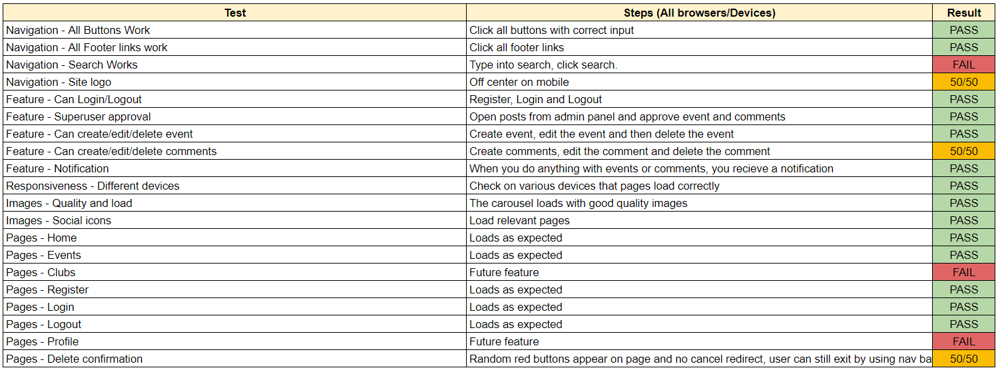
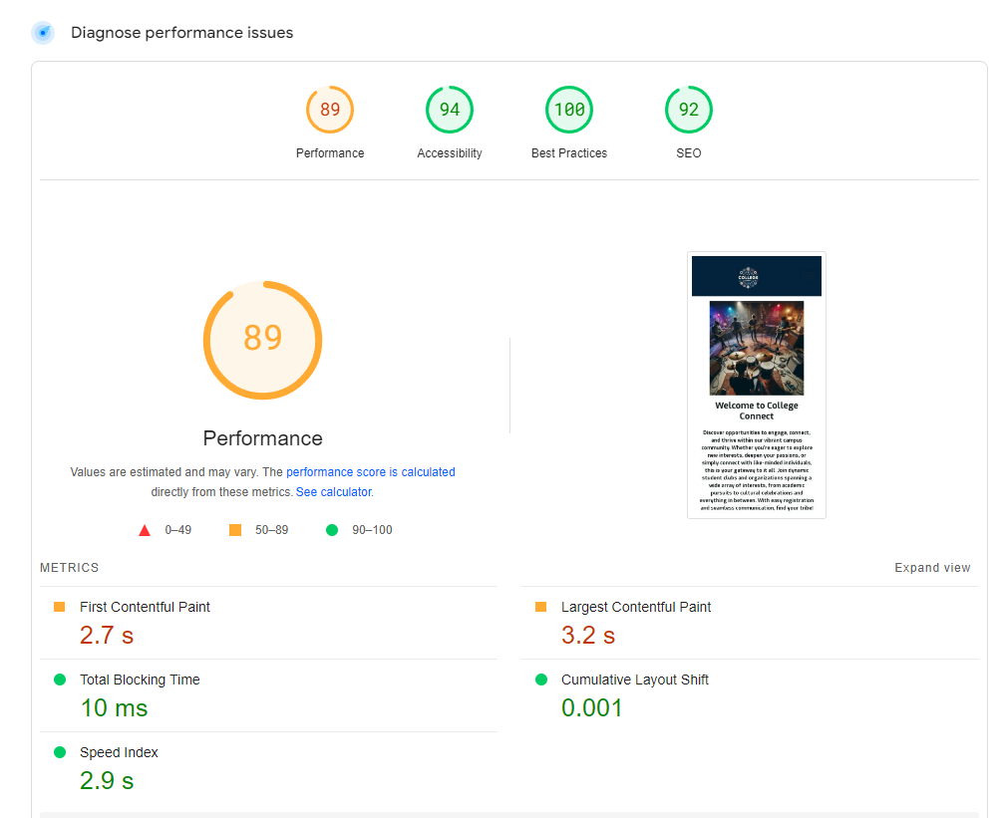
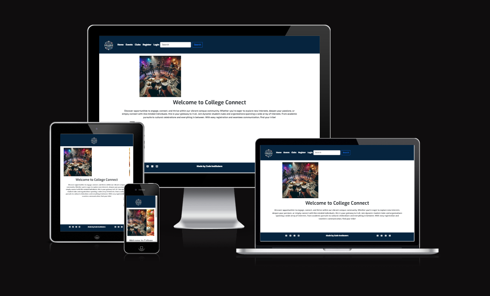

# College Connect (The Wombles)
College Connect is the all-in-one solution for students to engage, connect and thrive within the campus community. The site will be targeted at students eager to attend community events and event planners aiming to promote their initiatives. 
College Connect empowers students to make the most out of their college experience while providing event planners with the visibility they need to make their events a success.

### **Planning Stage**
The planning was as follows
  1. Select a project.
  2. Create user stories and dev tasks using Github Kanban board.
  3. Assign user stories to EPICS
  4. Create labels using MoSCoW method.
  6. Develop a wireframes of the potential app.
  7. Select colours for the app.
  8. Select fonts for the app.

[Github Kanban board can be found following this link]https://github.com/users/Karlsberg62/projects/4/views/1
While some variations can be visible in end product, we believe planning helped us to successfully work on this project and we tried to stay with choices made during the planning stage.

### **Site Goals**

#### Objectives

### **Wireframes**

For this project, we made wireframes to help with planning and design. While some changes were made as we went along and ideas were added to our project, original wireframes can be found below

- Home

- Event

- Events

- Clubs 

- Profile

## User Stories 

- As a user, I can log in & out  - Must Have 
- As a user, I can navigate to all pages - Must Have 
- As a user, I can sign up to an event - Must Have 
- As a user, I can see all the information for the event - Must Have 
- As a user, I can sign up to a club - Must Have  
- As a user, I can see all the information for the club - Must Have 
- As a user, I receive a notification that I have joined an event/club - Should Have 
- As a user, I receive a notification that I have made a comment/edited a comment - Should Have

## Features

### Existing features 

- Navigation Bar
  - Featured on all pages, the full responsive navigation bar includes links to the Logo and a search bar and is identical in each page to allow for easy navigation.
    - For users not logged in - Home page, Events, Clubs, Register and Login
    - For users logged in - Home page, Events, Clubs, Logout and Profile
  - This section will allow the user to easily navigate from page to page across all devices without having to revert back to the previous page via the ‘back’ button.
  - This section will also allow the user to search for items
- Navbar Logged Out

- Navbar Logged In

- Footer 
  - Holds social medias sites which open in new tabs to allow easy navigation
  - Footer is relevant to the student user encouraging them to keep connect via social media
  

- Landing Page
  - Includes a carousel showing the types of events on offer
  - Clear heading advising users where they are
  - A short about site information advising users of whats it has to offer

- Events Page

- Add Event 

- Update Event

- Delete Event

- Add Comment 

- Register Page

- Login Page

- Logout Page

### Future features 

## Forking the GitHub Repository
### **Wireframes**

For this project, we made wireframes to help with planning and design. While some changes were made as we went along and ideas were added to our project, original wireframes can be found below

- Home

- Event

- Events

- Clubs 

- Profile

## User Stories 

- As a user, I can log in & out  - Must Have 
- As a user, I can navigate to all pages - Must Have 
- As a user, I can sign up to an event - Must Have 
- As a user, I can see all the information for the event - Must Have 
- As a user, I can sign up to a club - Must Have  
- As a user, I can see all the information for the club - Must Have 
- As a user, I receive a notification that I have joined an event/club - Should Have 
- As a user, I receive a notification that I have made a comment/edited a comment - Should Have

## Features

### Existing features 

- Navigation Bar
  - Featured on all pages, the full responsive navigation bar includes links to the Logo and a search bar and is identical in each page to allow for easy navigation.
    - For users not logged in - Home page, Events, Clubs, Register and Login
    - For users logged in - Home page, Events, Clubs, Logout and Profile
  - This section will allow the user to easily navigate from page to page across all devices without having to revert back to the previous page via the ‘back’ button.
  - This section will also allow the user to search for items
- Navbar Logged Out

- Navbar Logged In

- Footer 
  - Holds social medias sites which open in new tabs to allow easy navigation
  - Footer is relevant to the student user encouraging them to keep connect via social media
  

- Landing Page
  - Includes a carousel showing the types of events on offer
  - Clear heading advising users where they are
  - A short about site information advising users of whats it has to offer

- Events Page

- Add Event 

- Update Event

- Delete Event

- Add Comment 

- Register Page

- Login Page

- Logout Page

### Future features 

## Forking the GitHub Repository

### Color Pallette

- Initial Color Pallette
- 
- #06243E This blue was swapped for the shade in our original colour pallette so that the logo and header background colours would match for aesthetic reasons. 

### Fonts
-Exo Extra Bold
-Open Sans Serif

## **Technologies Used**

### Main Languages Used

- HTML5
- CSS3
- Python
- Javascript

### APIs Used
- 

### Frameworks, Libraries & Programs Used

- Django - Python framework for easy backend development
- Bootstrap - CSS library for styling
- Google Fonts - for the font families:
- Font Awesome - to add icons to site
- VSCode, GitPod, & Codeanywhere - where all site files were developed 
- GitHub - to store the repository for submission.
- Canva - for image editing and collage
- Pexels - for images
- Imgcolorpicker for color matching https://www.imgcolorpicker.com/ 

### Image Generator Used
 - Generated by: ChatGPT
 - Version: ChatGPT 3.5
 - Publisher: OpenAI
 - Date: March 6, 2024
 - Location: ChatGPT

#### Logo Text Input for Image Generator 
 -Circular Design:
The logo will be circular, representing unity, connection, and inclusivity.
The circular shape suggests community and collaboration.
Color Palette:
I’ll use the color palette you provided:
Light Blue (#91BFEA)
Dark Blue (#132F3F)
White (#FFFFFF)
Light Peachy-Pink (#F9A8B8)
Dark Brownish-Red (#200809)
Typography:
The text “College Connect” will be the focal point.
Use the Exo ExtraBold font for a bold and modern look.
The font size will be adjusted to fit within the circular

## **Testing**

Testing carried out on Chrome, Opera & Edge. 
Testing carried out via Chrome dev tools with all devices for responsiveness.

## **Credits**
Thank you for the team effort to:
- Karlos https://github.com/Karlsberg62/Hackathon-3
- Ben Fashan
- Ellis Taylor 
- Steph Shobiye https://github.com/StephShobiye/Hackathon-3

* 

Happy coding!

